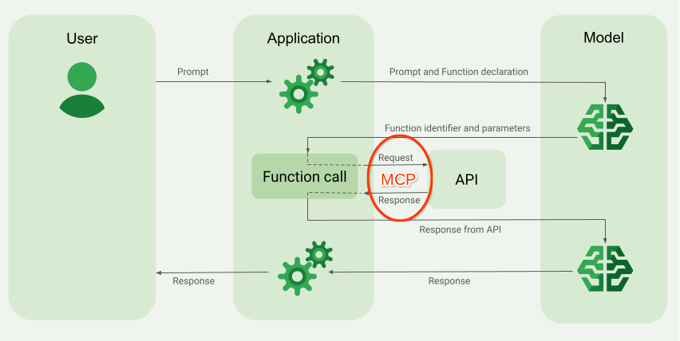

# Gemini Function calling, and how it relates to MCP

This is an example of an app that calls into the Gemini Model, passing it a set
of functions that are available in the app. This is what Gemini calls ["Function
calling"](https://cloud.google.com/vertex-ai/generative-ai/docs/multimodal/function-calling);
basically the Model can tell the app (agent) to invoke functions to gather more
information that will be helpful in generating a responnse to the user prompt.

## Framing

I built this some time ago as a way to explore this capability in Gemini models,
and I shared it with the intention to educate and illustrate.

Since I originally shared this, there has been plenty of activity in this
space. Two big items: Anthropic published the [Model Context Protocol
(MCP)](https://modelcontextprotocol.io/introduction) specification; Google
published the [Agent Development Kit](https://google.github.io/adk-docs/).

* If I were building an agent today, that would use the Gemini models or other
  models, along with various tools, I'd use the [Agent Development
  Kit](https://google.github.io/adk-docs/). The ADK is a helpful framework for
  building such things, and supports multiple models cleanly, and a way to
  register "tools" of various kinds.  It's really well thought out.

* If I were building a service that I wanted to be accessible from arbitrary
  agents or chatbots, I'd use MCP, probably via [jlowin's FastMCP
  framework](https://github.com/jlowin/fastmcp).

This repo remains valuable, to illustrate and clarify the fundamentals and the underlying
interactions.  This might be a good thing to go through, and try out, if you are learning
MCP and want to understand its purpose, rather than trying to understand the specifics of
the protocol.


## Background

Large Language Models (LLMs) seem almost magic. But they are constrained by some limitations:

- They are frozen after training, leading to stale knowledge.
- They can't query or modify external data.

The above and some of the text following is paraphrased from [Google's
documentation](https://cloud.google.com/vertex-ai/generative-ai/docs/multimodal/function-calling).

_Also, the above isn't 100% true at this point_.  The [Gemini
UI](https://gemini.google.com) can now provide correct and accurate answers to
these questions:
  - "Can you tell me the weather in Des Moines, IA?"
  - "Are the Seattle Mariners playing tonight, and if so, which team are they playing?"

This is because the latest Gemini models are augmenting the LLM capabilities with Google
Search on the server side. So while a given Gemini model might be "frozen" based on its
training date, it can query at least _some_ external tools now, all on its own.

_But_ the remote Gemini model obviously cannot directly plug into systems or services that
are local to your environment.

Function calling can mitigate this limitation. Function calling is sometimes referred to as
_tool use_ (that's what Anthropic calls it) because it allows the model to augment its
knowledge with information obtained via systems outside its purview, via functions defined
within the app's logic, or remote APIs accessible to the app, but not accessible directly by
the Gemini model.

## How does function calling work in Gemini?

It looks like this:


In English,


1. The app defines functions, and the application code hosts the logic for these
   functions that can perform specific actions (e.g., get current weather, fetch
   product details from a database, book a meeting).

2. The app passes function descriptions to the remote model (Gemini),  along with the user
   prompt, eg,  "This week, which evening will be cooler, Wednesday or Thursday?"
   These function descriptions include the name, parameters, and purpose
   of each available function.

3. Gemini analyzes the prompt: If Gemini determines that responding to the
   user's request requires additional information from one of the defined
   functions, Gemini doesn't try to answer directly.  Instead, Gemini returns a
   "function call" request, a structured JSON object indicating which function
   it wants the agent to call and with what arguments - probably extracted from
   the user's prompt.

4. The app executes the function, with the provided arguments.

5. The app then sends the function's result back to Gemini, along with the
   original prompt.  "The user said THIS, and also here's the information from
   that function you asked me to invoke."

6. Gemini uses the additional "context" to generate a final response: Gemini
   incorporates the information from your function's execution to provide a
   comprehensive and relevant answer to the user's original prompt.

7. The application returns the response to the user.

Steps 2 through 5 can be iterative.

NB: While the documentation on the referenced page specifically refers to Vertex AI,
the generic Gemini endpoint available at generativelanguage.googleapis.com also supports
function calling. This repo demonstrates some of that.


## OK, So what's going on in this Repo?

This example code shows how an app can invoke "the Gemini API" located at generativelanguage.googleapis.com :

 1. ...to list available models, and to generate content.
    The latter could be used, for example, to ask for a dynamically-generated limerick or
    to suggest ideas for a holiday in Croatia - normal LLM Chat use cases circa 2024.

    This is in [test1-gemini-generate-content.py](./test1-gemini-generate-content.py)

 2. ...to generate content with the aid of tools available in YOUR APP that Gemini can
    ask your app to invoke.

    This is in [test2-gemini-function-calling.py](./test2-gemini-function-calling.py)

    In this case the tools are a weather forecast tool, and a scrabble word score calculator tool.


## By The Way: The difference between the generic Gemini endpoint and Vertex AI

Both Gemini and Vertex AI  are accessible via API endpoints. Both of them generate content dynamically.

The key difference lies in their intended use cases and features:

- The generativelanguage.googleapis.com endpoint (often referred to as the
  Gemini API or Google AI Studio's API) is designed for developers to quickly
  get started and prototype with Gemini models. It's simpler to use, often
  leveraging API keys for authentication.

- The aiplatform.googleapis.com endpoint is part of Vertex AI, Google Cloud's
  unified machine learning platform. This endpoint is geared towards enterprise
  applications and production environments. It offers more robust features like
  integration with other Google Cloud services (IAM for authentication, MLOps
  tools), data residency options, and potentially different pricing and quota
  structures.

A good approach: start with generativelanguage.googleapis.com for exploration
and early development. When you're ready to build scalable, production-ready
applications with more control and integration, transition to the Vertex AI
endpoint.


## Using Function Calling with the Gemini API, in detail

OK let's get started.

A simple API call to Gemini might look like this:

```
POST :gemini/v1beta/models/:model:generateContent
Content-Type: application/json
x-goog-api-key: :apikey

{
  "contents": [
    {
      "role": "user",
      "parts": [
        {
         "text": "What are some good approaches to improving my sleep quality?"
        }
      ]
    }
  ],
  "generation_config": {
    "temperature": 1,
    "topP": 1
  }
}
```

In the above :
- `:gemini` => `https://generativelanguage.googleapis.com`
- `:model` => something like `gemini-2.5-flash` or one of the other available Gemini models
- `:apikey` => a key you get from [Google AI Studio](https://aistudio.google.com/)
- `:generateContent` => is what it is. It does not get replaced with anything. It's just part of the Gemini API interface.

In this case, the caller is not telling Gemini about any available tools. Gemini
will be able to respond to this kind of prompt ("What are some good approaches
to improving my sleep quality?") without any extra outside help.

In the case where there are local tools,
when submitting a prompt to the LLM, the app augments that JSON to provide the model with a
description of "tools" that the app can use to help the LLM respond to the user's prompt.

A modified payload might look like this:

```
POST :gemini/v1beta/models/:model/:generateContent
Content-Type: application/json
x-goog-api-key: :apikey

{
  "contents": [
    {
      "role": "user",
      "parts": [
        {
          "text": "In Scrabble, what is the minimum score for the word Rabblerouser?"
        }
      ]
    }
  ],
  "tools": [
    {
      "functionDeclarations": [
        {
          "name": "get_min_scrabble_word_score",
          "description": "Returns the minimum score for a given word in the game Scrabble (tm)",
          "parameters": {
            "type": "object",
            "properties": {
              "candidate": {
                "type": "string",
                "description": "The word to score"
              }
            },
            "required": [
              "candidate"
            ]
          }
        }
      ]
    }
  ]
}
```

(Actually, [Gemini](https://gemini.google.com) is smart enough to figure out
Scrabble word scores now too, but let's just put that aside for the moment.)

When you send that request to Gemini, you _can_ get a response like the following:

```json
{
  "candidates": [
    {
      "content": {
        "parts": [
          {
            "functionCall": {
              "name": "get_min_scrabble_word_score",
              "args": {
                "candidate": "Rabblerouser"
              }
            }
          }
        ],
        "role": "model"
      },
      "finishReason": "STOP",
      "index": 0
    }
  ],
  "usageMetadata": {
    "promptTokenCount": 82,
    "candidatesTokenCount": 24,
    "totalTokenCount": 172,
    "promptTokensDetails": [
      {
        "modality": "TEXT",
        "tokenCount": 82
      }
    ],
    "thoughtsTokenCount": 66
  },
  "modelVersion": "models/gemini-2.5-flash-preview-05-20"
}
```

Notice the `$.candidates[0].content.parts[0].functionCall` in the response.
This is Gemini saying to _your app_: please invoke that function you told me
about, with these arguments. If your app is designed correctly, it invokes the
function locally, and then passes back information to Gemini about the results,
along with original prompt, and Gemini's instruction to call the function, in
order.

The resulting structure is like this:

```json
{
  "contents": [
    ORIGINAL PROMPT
    INSTRUCTION TO CALL TOOL
    RESULT FROM TOOL
  ]
  ...
}
```

It looks like so:

```json
{
  "contents": [
    {
      "role": "user",
      "parts": [ { "text": "In Scrabble, what is the minimum score for the word Rabblerouser?" } ]
    },
    {
      "role": "model",
      "parts": [
        {
          "functionCall": {
            "name": "get_min_scrabble_word_score",
            "args": {
              "candidate": "Rabblerouser"
            }
          }
        }
      ]
    },
    {
      "role": "tool",
      "parts": [
        {
          "functionResponse": {
            "name": "get_min_scrabble_word_score",
            "response": {
              "content": {
                "candidate": "Rabblerouser",
                "result": 19
              }
            }
          }
        }
      ]
    }
  ]
  ...
}
```

In that payload, you're giving Gemini the original prompt, PLUS the thing it asked for, PLUS
the data you collected at its request.

And then Gemini can assemble and digest all of that information and provide back another
coherent response. This back-and-forth can continue for multiple iterations. In each
response, if Gemini thinks (a) that it does not have enough information to provide a
complete response, and (b) that getting information from the tools your app has access to,
can help produce a correct answer, it will tell your app that, by sending back
"functionCall" elements in the response as shown above.

Depending on the number of tools you register and the query you pass in, your app may need
to iterate a few times, going back and forth with Gemini, before Gemini gives a final
answer. This is called the Reasoning/Action loop, aka ReAct loop.

The example code here shows that. On each successive iteration it shows what it sends back
to Gemini, and what Gemini sends in return.  It'a a good way to gain insight into how
"tool use" aka "function calling" works.


## Trying the code - Pre-requisites

You need these things:

- to have python and pip installed on your machine

- an API key for Gemini, that you can get for free at [Google AI Studio](https://aistudio.google.com/).

- an API Key for TomTom, that you can get for free from [TomTom](https://developer.tomtom.com).

  When you create the key, register it for the Geocoding APIs.

- store the keys in a file named `.env`. It should be formatted like this:
  ```sh
  TOMTOM_APIKEY=value-you-got-from-tomtom
  GEMINI_APIKEY=value-you-got-from-Google-AI-Studio
  ```

## One time setup

Make a new directory. Set up a venv for python.

```bash
python3 -m venv .venv
source .venv/bin/activate
pip install -r requirements.txt
```

## Run the basic "generate content" test

This will select one of a fixed set of prompts, send it to Gemini, and display the results.

```bash
python3 ./test1-gemini-generate-content.py
```

This is just an app using the REST API for Gemini. No tools involved.


## Run the function calling test

This will select a function calling prompt, and engage in the back-and-forth
with Gemini, and finally display the final result:

```bash
python3 ./test2-gemini-function-calling.py
```

The "tools" defined for this test include:
 - `get_weather_forecast` - even though Gemini can do this itself.
 - `get_min_scrabble_word_score` - even though Gemini can do this too.
 - `get_is_known_word` - this performs a dictionary lookup on a word candidate, to determine if it is a valid word to be scored in Scrabble.

These are all implemented as functions that are known to the python script.

When Gemini sends a response with "functionCall" in it, the script invokes the
designated function call available locally.

> This is python, which is a dynamic environment and invoking functions by name
> this way is pretty easy.  But the same approach would work with any app or
> environment that can conditionally invoke methods, providing dynamic arguments
> to those methods.  It will work in Java, C#, Bash/curl, JavaScript, Powershell, Golang,
> etc.

This script also prints the payloads sent in and out, during this exchange, to
allow you to see what's happening.

When using a scrabble-oriented question, Gemini sends back a request to call the
`get_is_known_word` function, and after the app sends back the answer from that,
Gemini may also send back a request to call the `get_min_scrabble_word_score`
function.  That shows the iterative back-and-forth.


### One note on the `get_weather_forecast` function

The `get_weather_forecast` function is implemented via a set of remote API requests,
first to resolve a placename like "Chicago IL" to a latitude/longitude, and then
to get the weather forecast for a given latitude/longitude.

This just illustrates that a "function" need not only be dependent upon local calculation.
It can do ... lots of things. Anything you can implement in software.


## How does this differ from AI-based Agents ?

This is ... the beginning of Agentic AI. It's connecting invokable functions to a LLM.  The
idea behind _an agent_ is not limited to supplying more context to the LLM, but
extends to "performing work". Performing a database update, or playing a music
playlist, or opening the garage door, and so on.  But the interaction model is
basically the same:

 - the app collects a "prompt", sends it to the LLM
 - the LLM may respond with a request for more information, or, in the case of an
   agent scenario, the LLM may respond with a requested ACTION to perform.
 - the app then sends results back up to the LLM
 - this back-and-forth cycle may continue

Google publishes an Agent Development Kit that allows you to build agentic apps
more easily. Those apps can be things that run on the command line, or something
that runs on a mobile phone, or a desktop, or as a cloud-based service.

This "function calling" example is just a minimalistic approach implementing the same capability.

## What about MCP?

[Model Context Protocol (MCP)](https://modelcontextprotocol.io/introduction)
prescribes a proposed "standard" model for describing tools to chatbots, and
allowing chatbots to invoke tools. With MCP, Anthropic is saying "We think this
is a good way for chatbots to plug into tools".  They support it in their
chatbot, and encourage others to support it too.

As depicted in the diagram above, an Agentic System involves 3 actors: Agent/chatbot, LLM,
and Tools Server. The agent communicates to both the LLM and the tools server. (In the
general case the agent could talk to more than one model, and more than one tools
server). The LLM and tools server do not directly connect. The LLM knows about tools only to
the extent that the agent informs it; and the Tools Server doesn't know anything about the
LLM.

MCP describes how the agent talks to the Tools Server. It does not describe how
the agent talks to the LLM.

Google has defined a Gemini-specific format, which I discussed above, to allow
the agent to describe tools to the LLM. Anthropic, for its Claude Opus and
Sonnet models, describes _an alternative_ way for agents to describe tools to the
LLM.  It looks like this:

```json
{
  "tools" : [
    {
      "name": "get_current_weather",
      "description": "Get the current weather in a given location",
      "input_schema": {
        "type": "object",
        "properties": {
          "location": {
            "type": "string",
            "description": "The city and state, e.g. San Francisco, CA; or a zip code e.g. 95616"
          }
        },
        "required": ["location"]
      }
    },
   ],
   ...
}
```

This is _almost the same as_ the JSON that Gemini uses:

```json
  "tools": [
    {
      "functionDeclarations": [
        {
          "name": "get_current_weather",
          "description": "Get the current weather in a given location",
          "parameters": {
            "type": "object",
            "properties": {
              "location": {
                "type": "string",
                "description": "The city and state, e.g. San Francisco, CA; or a zip code e.g. 95616"
              }
            },
            "required": ["location"]
          }
        }
      ]
    }
  ]
```

The point is, MCP doesn't talk about that! MCP defines the agent->tools link; _it does not
have anything to say about how the agent talks to the LLM_.




> NB: Given that, it would be
> inappropriate to say "Gemini supports MCP", or "Claude Sonnet supports MCP" or even "an LLM
> supports MCP."  It's not the model that would support MCP, it's the chatbot or the agent.
> Some people conflate the chatbot and LLM into one thing, and call it "the LLM". I think that
> confuses things.

In this example, the "tools" available to the custom agent in this repo are hand-coded in
python and directly linked. The agent and the functions it might invoke, are defined all in
one program. MCP is not used here, but if I had used it, it would allow separation between
those.

Regardless whether there is separation between the agent and the tools, the
agent will still send up a payload to the LLM describing which tools it can
access.

If MCP is involved, the things in the `tools` array will be obtained from the MCP Servers
that are available, rather than from hard-coded names of local python (or JavaScript, or
Java, etc) functions.


## Interesting Note

I'm not a python expert. I know C#, Java, JavaScript, and a little Powershell,
but not much python.  Despite that, I implemented this example in just a few
hours. It took me longer to write the README.

How did I work this magic?  Almost all of the python code in this repo was
generated by Gemini, in response to English language prompts.

I started with this:
```
Make a new Python script that will use the requests module to make an
outbound HTTP request, and display the JSON-formatted response.  It should
be a GET request, to this URL:

https://generativelanguage.googleapis.com/v1beta/models?key={API_KEY_HERE}
```

And that gave me the start.

And I also got particular with lots of prompts like this:
```
Implement the get_min_scrabble_word_score function in callable_functions.py ,
using these letter scores:

(1 point) - A, E, I, L, N, O, R, S, T, U
(2 points) - D, G
(3 points) - B, C, M, P
(4 points) - F, H, V, W, Y
(5 points) - K
(8 points) - J, X
(10 points) - Q, Z

Add a bonus of 1 point for each character in the word beyond the 9th letter.
```

The result of that was:
```py
def get_min_scrabble_word_score(*args):
    """
    Calculates a Scrabble score for a word based on standard letter values.
    Expects the word as the first argument.
    - Non-ASCII characters result in a score of 0.
    - Bonus of 1 point for each character over 9.
    Letter scores:
    (1 point) - A, E, I, L, N, O, R, S, T, U
    (2 points) - D, G
    (3 points) - B, C, M, P
    (4 points) - F, H, V, W, Y
    (5 points) - K
    (8 points) - J, X
    (10 points) - Q, Z
    """
    if not args:
        print("Error: get_min_scrabble_word_score expects at least one argument (word).")
        return 0
    word = args[0]

    letter_scores = {
        'A': 1, 'E': 1, 'I': 1, 'L': 1, 'N': 1, 'O': 1, 'R': 1, 'S': 1, 'T': 1, 'U': 1,
        'D': 2, 'G': 2,
        'B': 3, 'C': 3, 'M': 3, 'P': 3,
        'F': 4, 'H': 4, 'V': 4, 'W': 4, 'Y': 4,
        'K': 5,
        'J': 8, 'X': 8,
        'Q': 10, 'Z': 10
    }
    total_score = 0

    for char_original in word:
        char_upper = char_original.upper()
        if not char_upper.isascii():
            return 0  # Stop and return 0 if non-ASCII character is found

        total_score += letter_scores.get(char_upper, 0) # Default to 0 for non-letters (though isascii should catch most)

    # Add bonus points for word length over 9 characters
    if len(word) > 9:
        bonus_points = len(word) - 9
        total_score += bonus_points

    return total_score
```

Gemini is Amazing.


## Disclaimer

This example is not an official Google product, nor is it part of an
official Google product.

## License

This material is [Copyright © 2025 Google LLC](./NOTICE).
and is licensed under the [Apache 2.0 License](LICENSE).
